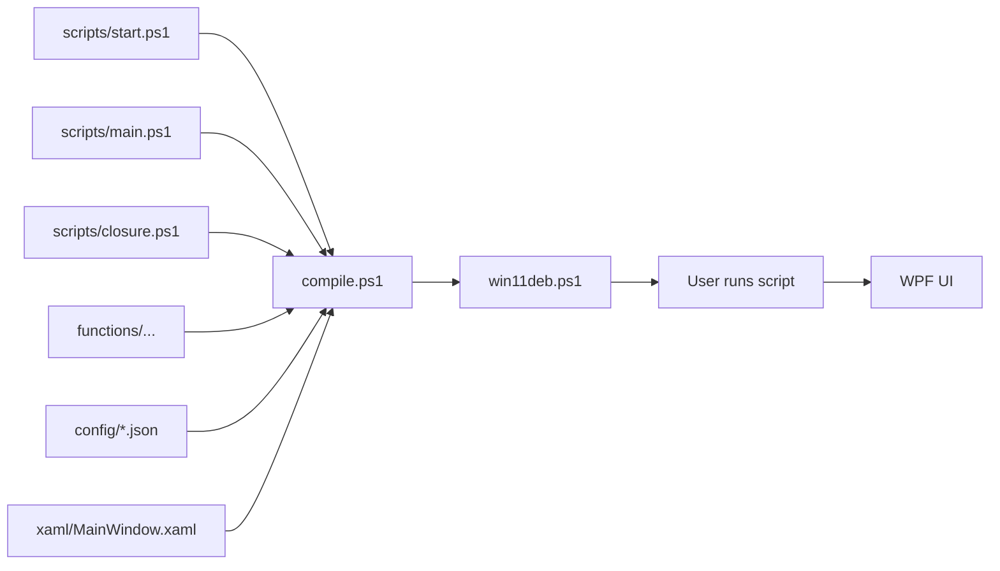

import { Image } from 'astro:assets';
import infoImg from '../../../assets/images/2024/Windows_11_Optimizer_Debloater/info.png';
import installImg from '../../../assets/images/2024/Windows_11_Optimizer_Debloater/install.png';
import debloatImg from '../../../assets/images/2024/Windows_11_Optimizer_Debloater/debloat.png';
import optimizationImg from '../../../assets/images/2024/Windows_11_Optimizer_Debloater/optimization.png';
import updatesImg from '../../../assets/images/2024/Windows_11_Optimizer_Debloater/updates.png';
import configImg from '../../../assets/images/2024/Windows_11_Optimizer_Debloater/config.png';


<div style="display: flex; flex-wrap: wrap; justify-content: center; align-items: center; gap: 5px; padding: 20px 0;">
  
  
  
  
  
  
</div>

I built [Windows11-Optimizer-Debloater](https://github.com/vukilis/Windows11-Optimizer-Debloater) because I got really tired of setting up a fresh Windows install, only to spend the next couple of hours uninstalling bloatware, hunting down drivers, and tweaking settings that should just be sensible by default. So I made a tool that handles all of that in one place.

This script gives you a clean dashboard to view your system info, install the apps you actually want, strip out the junk Windows ships with, apply a handful of useful performance tweaks, and take back control of Windows Update. Everything runs from a single menu, and you can even save your exact setup to a config file so you can replay it on future machines.

## One Command - Download and Usage

You need to run PowerShell or Windows Terminal **as Administrator** for this to work properly.

### Stable Branch (recommended):

```powershell
iwr -useb vukilis.com/win11deb | iex
```

### Development Branch:

```powershell
iwr -useb vukilis.com/win11dev | iex
```

### Headless Mode

If you want to apply your setup without clicking through the GUI, you can export your configuration from the tool to a `config.json` file and run it like this:

```powershell
& ([ScriptBlock]::Create((irm https://vukilis.com/win11deb))) -Config .\config.json
```

## Architecture

This project uses a **compile-time concatenation** architecture. Source files are organized by function and compiled into a single artifact containing `10,612` lines of code.

Even rolling everything into one neat artifact, the script runs within 5,542 ms (5s).



## Parts of Utility

This utility shows basic system information, installs programs, debloats and optimizes Windows with tweaks, troubleshoots with config, and fixes Windows updates.

### **INFO**

Right when you launch the tool, it shows you a clean snapshot of your system - OS version, CPU, GPU, RAM, Motherboard, and storage - so you know exactly what you are working with before making any changes.

<Image src={infoImg} alt="info" widths={[640, 960, 1280, 1600]} sizes="(max-width: 768px) 100vw, 900px" formats={['avif', 'webp']} quality={80} loading="lazy" />


### **INSTALL**

This is where the tool really shines. Instead of hopping between Winget, Chocolatey, and random download pages, you get a single, searchable list of common apps organized by category.

<Image src={installImg} alt="install" widths={[640, 960, 1280, 1600]} sizes="(max-width: 768px) 100vw, 900px" formats={['avif', 'webp']} quality={80} loading="lazy" />

#### How it works

First, pick your package manager - `Winget` (default) or `Chocolatey` - at the top of the tab. When you switch to Chocolatey, apps that are not available there are automatically grayed out, so you never accidentally pick something that will fail.

Next, browse the categories on the left: **Development**, **Microsoft Tools**, **Browsers**, **Communications**, **Gaming Launchers**, **Document**, **Multimedia Tools**, **Utilities**, **Pro Tools**, and **Selfhosted Tools**. Each category has a list of apps with checkboxes.

#### Presets

If you are not sure where to start, there are three presets you can toggle:
- **Lite Preset** - covers the everyday essentials like Git, VS Code, 7-zip, VLC, Notepad++, Discord, Steam, and a handful of utilities most people reach for.
- **Dev Preset** - builds on Lite and adds Visual Studio 2022, GitHub Desktop, Node.js tools, .NET runtimes, Slack, Teams, and Zoom.
- **Gaming Preset** - adds launchers like Steam, Epic Games, Ubisoft Connect, EA App, and OBS for streaming.

**What each button does:**

- **Install** - installs every app you have checked using your selected package manager. For example, checking VS Code, Git, and Docker Desktop and hitting Install will silently pull down all three in sequence.
- **Installed** - scans your machine for apps already installed via **winget** or **chocolatey*** and automatically checks their boxes. It is a quick way to see what you already have without opening Settings or Programs and Features.
- **Uninstall** - removes every checked app from your system. This is handy if you want to strip out a few things you tried and did not like, or clean up before a fresh reinstall.
- **Upgrade** - updates every checked app to its latest version. If you have not touched your apps in a while, this is the fastest way to bring everything up to date in one click.
- **Clear Selection** - unchecks every app and disables any active presets. Use this when you want to start your app list from scratch.

Under the hood, the tool talks to winget with flags like `--accept-source-agreements --accept-package-agreements --silent`, so installs do not pop up extra windows asking for permission. For Chocolatey, it runs `choco install`, `choco uninstall`, or `choco upgrade` with the `-y` flag.

### **DEBLOAT**

<Image src={debloatImg} alt="debloat" widths={[640, 960, 1280, 1600]} sizes="(max-width: 768px) 100vw, 900px" formats={['avif', 'webp']} quality={80} loading="lazy" />

Windows 11 ships with a ton of pre-installed apps most people never asked for - things like Clipchamp, Bing apps, Weather, News, and various Microsoft Store games. The Debloat tab lets you remove them in bulk.

On the left side, you see a searchable list of bloatware apps. You can use `Select All` to grab everything, or cherry-pick the ones that annoy you. When you click `Select`, the chosen apps move into a preview panel on the right so you can confirm exactly what will be removed. Hit `Uninstall`, and the tool removes those APPX packages for you.

There is also an `Xbox Preset` that selects every bloatware app except the essential Xbox and gaming services, in case you actually use Game Bar or Game DVR.

Special handling is built in for **Microsoft Teams** - it stops running processes, removes the old Win32 version, deletes leftover APPX packages, and cleans up the AppData folder and registry keys so it does not come back after a reboot.

### **OPTIMIZATION**

This tab is where you turn off the noisy background stuff and push Windows toward behaving like a desktop OS instead of a data collection service.

<Image src={optimizationImg} alt="optimization" widths={[640, 960, 1280, 1600]} sizes="(max-width: 768px) 100vw, 900px" formats={['avif', 'webp']} quality={80} loading="lazy" />

At the top, you have two preset buttons:
- **Mega Preset** - applies a broad set of tweaks including disabling telemetry, delivery optimization, activity history, search indexing, background apps, hibernation, storage sense, GameDVR, autoplay volume adjustments, and more. It also enables the Ultimate Performance power plan, removes OneDrive, and applies a classic right-click menu.
- **Fast Preset** - a lighter touch that focuses on the most impactful changes: disable telemetry, disable background apps, disable GameDVR, enable Game Mode, disable Windows sounds, set the power plan for performance, and a few other quality-of-life fixes.

Below the presets, everything is broken into checkboxes and toggles so you can build your own combination. Some examples of individual tweaks you can apply:

- **Disable Telemetry** - stops Windows from sending usage data back to Microsoft.
- **Disable BitLocker** - turns off BitLocker drive encryption if you do not need it.
- **Disable Delivery Optimization** - stops Windows from using your PC to distribute updates to other devices on your network.
- **Disable Recall** - removes the Recall feature that snapshots your screen activity.
- **Disable Intel MM / vPro LMS** - turns off Intel Manageability services if you are on a consumer CPU.
- **Disable Razer Software Auto-Install** - blocks Razer Synapse from silently installing extras.
- **Disable Microsoft Copilot** - removes the Copilot sidebar and button from the taskbar.
- **Remove Cortana** - fully removes the Cortana app and search integration.
- **Classic Right-Click Menu** - restores the old Windows 10 right-click menu instead of the cluttered Windows 11 one.
- **Show File Extensions** - always shows `.exe`, `.msi`, `.txt`, and so on in File Explorer.
- **Dark Theme For Windows** - applies dark mode system-wide.

There is also a **Services** section where you can apply service-level changes like **Smart Startup**, **Set to Manual**, or **Restore to Default** - useful if you want to stop unnecessary background services from eating RAM.

And if anything goes wrong, the **System Restore Point** button is right there to roll back all changes to a known good state.

### **UPDATES**

Windows Update is famously aggressive about restarting at the worst possible time. This tab gives you real control over it:

<Image src={updatesImg} alt="updates" widths={[640, 960, 1280, 1600]} sizes="(max-width: 768px) 100vw, 900px" formats={['avif', 'webp']} quality={80} loading="lazy" />

- **Set Updates To Default** - puts everything back the way Microsoft intended.
- **Pause Updates** - pauses all updates for 35 days.
- **Security Updates Only** - configures Windows to download only security patches, defers feature updates for 365 days, quality updates for 4 days, and blocks driver updates automatically.
- **Disable Updates** - turns Windows Update off entirely. Not recommended for daily machines, but useful on isolated test systems or if you want to manage updates manually.
- **Reset Windows Update** - a deep clean that stops all update services, clears the download cache, re-registers update DLLs, and resets the update policies. This is the button to press when Windows Update gets stuck and refuses to download anything.

### **CONFIG**

This tab is for advanced users who want to tweak Windows Optional Features, access legacy Control Panel tools, or apply a handful of useful system tweaks.

<Image src={configImg} alt="config" widths={[640, 960, 1280, 1600]} sizes="(max-width: 768px) 100vw, 900px" formats={['avif', 'webp']} quality={80} loading="lazy" />

#### FEATURES

This tab handles Windows Optional Features - the ones you would normally find in "Turn Windows features on or off." You can enable:

- **All .Net Framework (2, 3, 4)** - enables legacy and modern .NET frameworks in one click.
- **HyperV Virtualization** - turns on Hyper-V and sets the hypervisor scheduler to classic mode.
- **Legacy Media (WMP, DirectPlay)** - brings back Windows Media Player, DirectPlay, and legacy media components for older games and apps.
- **Windows Subsystem for Linux** - enables WSL and the Virtual Machine Platform.
- **Windows Sandbox** - spins up a lightweight disposable VM for testing untrusted software.
- **NFS - Network File System** - enables the NFS client and applies standard NFS settings.

There are also smaller quality-of-life toggles, like enabling the legacy F8 boot recovery menu, creating a daily registry backup at 12:30 AM, and toggling search box web suggestions on or off.

#### Legacy Control Panel Shortcuts

Think of this as a shortcut menu to every Windows settings tool you normally have to hunt for in the Start Menu or run dialog. Clicking any of these opens the corresponding tool instantly:

- **Control Panel** - opens `control.exe`
- **Programs-Features** - opens `appwiz.cpl` to uninstall or modify programs.
- **Network Connections** - opens `ncpa.cpl` to manage adapters, VPNs, and DNS.
- **Power Plan** - opens `powercfg.cpl` to switch between balanced, high performance, or power saver.
- **Region** - opens `intl.cpl` to change format, location, and language settings.
- **Sound Settings** - opens `mmsys.cpl` to manage audio devices and levels.
- **System Properties** - opens `sysdm.cpl` to edit environment variables, computer name, and remote settings.
- **User Accounts** - opens `control userpasswords2` for managing local accounts and auto-logon.
- **Windows Firewall** - opens `firewall.cpl`.
- **Time and Date** - opens `timedate.cpl`.
- **Device Manager** - opens `devmgmt.msc`.
- **File Explorer Options** - opens `control folders`.
- **Registry Editor** - opens `regedit`.
- **Task Scheduler** - opens `taskschd.msc`.
- **Resource Monitor** - opens `resmon` to see exactly what is using your CPU, memory, disk, and network.
- **System Configuration** - opens `msconfig` to manage boot options and services.
- **Event Viewer** - opens `eventvwr.msc` to inspect system logs.
- **System Info** - opens `msinfo32` for a full hardware and software dump.
- **Disk Management** - opens `diskmgmt.msc` to partition and format drives.
- **Computer Management** - opens `compmgmt.msc` to access Device Manager, Disk Management, Event Viewer, and more from one window.


#### Configs

On top of the shortcuts, there are a few actionable tools:

- **Set Up Autologin** - downloads and runs Sysinternals Autologon.exe to configure automatic sign-in for a local or domain account.
- **Set Winget Settings** - configures winget to use a rainbow progress bar, English locale, portable package paths, disables telemetry, and enables error logging.
- **Set ADB Environment** - adds the Android Debug Bridge platform-tools folder to your user PATH so you can use `adb` from any terminal.
- **Add / Remove VSCode Context Menu** - adds or removes the "Open with Code" entry from your right-click menu in File Explorer.
- **Run Microsoft Activation Scripts (MAS)** - launches a helper to activate Windows via HWID, Ohook, KMS38, or Online KMS methods.
- **Create Win11Deb Shortcut** - drops a desktop shortcut that launches the tool as Administrator.
- **Reset Network** - runs `netsh winsock reset`, `netsh winhttp reset proxy`, and `netsh int ip reset` to fix broken network stacks.
- **Reset Sound** - restarts the Windows Audio service when audio glitches out.
- **Create Registry Backup** - exports `HKCU`, `HKLM`, and `HKCC` to a `.reg` file so you can roll back bad tweaks.
- **Apply DNS** - a dropdown to switch between your router's default DNS, Google DNS, Cloudflare DNS, OpenDNS, Quad9, AdGuard, Mullvad, and several other providers.

### Import / Export

If you have spent time carefully choosing apps, tweaks, DNS servers, and debloat choices, you do not have to repeat the process on every new machine. Use **Export Config** to save your exact setup to a JSON file, and **Import Config** to reload it later - or run it headless with the `-Config` flag.

## Conclusion

Whether you’re setting up Windows from scratch, giving an older PC a fresh start, or simply fed up with Windows Update and all the unnecessary bloat, this tool is here to make things easier.

It handles the whole process in one place: choose the apps you want, get rid of the junk you don’t, tune your system for better performance, take control of updates, and export your setup so you can easily reuse it later without starting from scratch.

### Development

Check out the **Windows11-Optimizer-Debloater** script on GitHub:  
https://github.com/vukilis/Windows11-Optimizer-Debloater

If you encounter any challenges or problems with the script, submit them via the **"Issues"** tab on the GitHub repository. By filling out the provided template, you can provide specific details about the issue.

If you want to contribute new features or fixes, please submit pull requests to the **DEV BRANCH** - direct merges to main are disabled. Make sure to document your changes thoroughly; PRs with unclear or missing explanations may be delayed.

| Resource | Description |
|----------|-------------|
| 📝 [CONTRIBUTING.md](https://github.com/vukilis/Windows11-Optimizer-Debloater/blob/main/CONTRIBUTING.md) | Contribution guidelines and workflow |
| 🛠️ [docs/DEVELOPMENT.md](https://github.com/vukilis/Windows11-Optimizer-Debloater/blob/main/docs/DEVELOPMENT.md) | Development setup and guidelines |
| 🐛 [Issues](https://github.com/vukilis/Windows11-Optimizer-Debloater/issues) | Report issues and request features |
| 💬 [CHANGELOG](https://github.com/vukilis/Windows11-Optimizer-Debloater/blob/main/CHANGELOG.md) | View the latest changes and updates |

### Credits

| Credit | Description |
|--------|-------------|
| 🖱️ **[jepriCreations](https://www.deviantart.com/rosea92)** | Windows 11 cursor concept [Free version](https://www.deviantart.com/jepricreations/art/Windows-11-Free-Tail-Cursor-Concept-962242647) • [HD version](https://www.deviantart.com/jepricreations/art/Windows-11-Cursors-Concept-HD-v2-890672103) |
| ⚡ **[massgravel](https://github.com/massgravel)** | Windows and Office activator [Microsoft Activation Scripts](https://github.com/massgravel/Microsoft-Activation-Scripts) |

